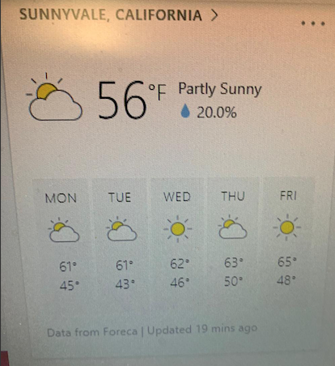

## Take home assignment: Cognizant (01/27/2019)

### Requirements

Develope a mini weather app that will consume data from backend and display it on the browser based on a city searched. The tech stack to be used is react, redux, thunk for Front End. The tech stack to be used for Back End is nodejs/Express. The data can be served static from any datta structure. Here is a sample image of how the front end should look like:

## Solution

### Hosting

## Front-End

[FE: Click here to see the hosted application](https://loving-mccarthy-24e034.netlify.com/)

## Back-End

[BE: Route to get all the forecast for a particular place](http://weather-app-be.herokuapp.com/forecast/Chennai)
[BE: Route to get all the distinct cities available](http://weather-app-be.herokuapp.com/cities)

### Tech-Stack

## Front-End

- React
- Redux
- Middlewares (Logger, Thunk)
- Axios (Access BE API)
- HTML5/CSS3 (Responsive)
- Netlify (Hosting)
- Jest/Enzyme
- Moxios (test axios call in action creator)
- PropTypes (test prop types)
- check-prop-types (test prop types)

## Back-End

- NodeJS
- Express
- Cors
- Jest/Supertest

## Back-End Repository Link

[Click here to view Back End Repository - Github](https://github.com/G3-Code/sampleappbe)
